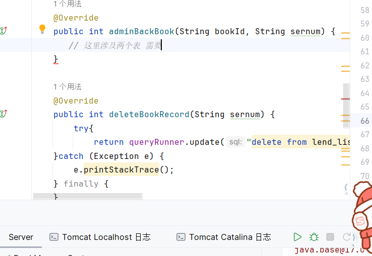
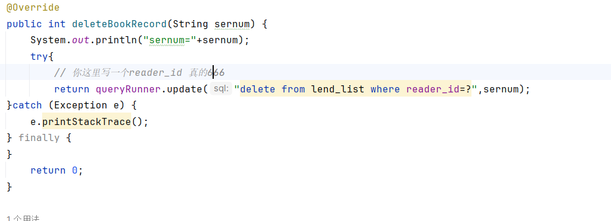

开发日志：
这段配置是Maven项目中用来引入 Lombok 库的依赖配置。

Lombok 是一个Java库，它通过注解的方式简化了Java代码的编写，特别是用于减少样板代码（boilerplate code）的编写。它可以通过注解来自动生成构造函数、getter、setter、equals、hashCode等方法，简化了Java开发中常见的繁琐工作。

具体来说：

<groupId>、<artifactId> 和 <version>: 这些标签指定了要引入的依赖的坐标信息，分别代表了库的组织ID、artifact ID和版本号。

<scope>: 这里设置为provided，表示该依赖在编译和测试阶段需要用到，但在运行时（比如部署到服务器上运行）不会被包含，因为它在特定的运行环境中已经提供了。

因此，添加了这个依赖之后，在项目中就可以使用Lombok提供的注解来简化Java代码的编写，减少样板代码，提高开发效率。


通过学习这个项目 发现 还是很有意思的 了解许多库，看肝一天能不能肝出来

c3p0

是一个别人编写的连接池 还有工具类


dbutils 跟mybatis差不多


lombok 通过注解不需要显示的写get set 有参 无参构造啥的啊，但是我们不是下了ptg吗 这个就无所谓了


你在删除里不要写获取 ，删除和获取是两个步骤，可以先删除 然后重新获取


BeanListHandler  是哪个包里面的


ChatGPT

ChatGPT

`BeanListHandler` 类位于 Apache Commons 包中的 `org.apache.commons.dbutils.handlers` 包下。它是 Apache Commons DbUtils 库的一部分，提供了简化 JDBC 操作的工具。

`BeanListHandler` 类是用于将查询结果集中的每一行数据映射到指定的 JavaBean 类型，并将这些对象存储在一个 List 中返回。

看这个 获取 他就封装一个对象，借助dbutils 工具 即可


所有 操作 增删改查， 只有查需要构建对象，其他的不需要，其他操作做完后 ，在执行一遍查的操作即可，问题不是很大。


```
  <frameset rows="140,*" frameborder=0 border="0" framespacing="0">
      <frame src="admin_menus.html" scrolling="no"  noresize name="menus" frameborder="no">
      <frame src="admin_main.html"  scrolling="yes" name="data" frameborder="no">
  </frameset>
</html>
```

用来布局，分成两个页面 上部分菜单不变

下部分可以改变


菜单页面里的链接设置了 `target="data"`，这个 `target` 属性指定了链接页面的打开方式，将链接指向的内容在名为 `data` 的框架中显示。比如，菜单中有一个链接是这样的：

```
<li><a href="admin_book_add.html" target="data">增加图书</a></li>

```

这个链接的作用是在被命名为 `data` 的框架中显示 `admin_book_add.html` 页面的内容。当用户点击了这个链接时，浏览器就会把 `admin_book_add.html` 这个页面加载并显示在第二个框架中（也就是被命名为 `data` 的那个框架）。

所以，整体上来说，通过菜单页面中链接的 `target` 属性，设置了链接页面在特定框架中的显示位置，实现了点击菜单时第二个框架内容的变化。


### json

json 是用来和服务端跟浏览器进行通信的格式。

java对象转为json 要借助第三方工具

但是go的话可以用marshal 啥的

gson。是 google开发的


java对象转成json 类型的字符串  然后前端 将字符串转换为json对象。


假设我有，然后一直点，就行。


编辑 ：如何回显


图书馆在馆状态。

一般都是查数据库，被借出去肯定不能删除啊，不然有bug


如何动态删除某一行。删除id 

用remove这个办法


根据id 跳转到编辑页面

然后前端拿到数据异步，

更新完数据 然后跳转回去。


### 如何同时更新两个表


### 记住密码

？ 用cookie 完成 保存在浏览器，然后浏览器自己填充。

记得写文档，很重要。 

java 怎么写入浏览器，把cookie 写入java 对


session 存在服务器里的

cookie 携带session id

浏览器第一次访问服务器的时候 服务器会开辟一块内存，

生成对应的sessionID

把session id 作为cookie 写入数据浏览器，浏览器每次访问携带id即可。


没有外键的修改 用到了事物

```
PreparedStatement ps2 = connection.prepareStatement("insert into reader_card 
```

预处理语句（Prepared Statements）在数据库编程中有几个重要的优势：

1. **性能优化：** 预处理语句在数据库中被编译一次，并且可以被多次执行。这种预先编译的特性可以提高性能，尤其是当需要执行多次相同结构的查询或更新时。数据库可以缓存这些预编译的语句，减少了每次执行SQL语句时的解析和编译时间，从而提高了执行速度。
2. **安全性增强：** 预处理语句可以防止SQL注入攻击。使用占位符（`?`）的方式将参数传递给预处理语句，避免了直接将用户提供的数据嵌入到SQL语句中，因此大大降低了恶意操作数据库的风险。
3. **代码可读性和维护性：** 预处理语句使得SQL语句与业务逻辑分离，提高了代码的可读性和维护性。参数化的SQL语句更清晰地展示了数据和逻辑之间的关系，使得代码更易于理解和维护。
4. **数据类型安全性：** 预处理语句允许开发人员使用适当的数据类型传递参数，确保了参数的类型安全性，避免了类型转换错误。

综上所述，预处理语句通过提高性能、提升安全性、改善代码可维护性等方面的优势，在数据库编程中得到了广泛的应用。


```
添加图书 和借书有点问题
```

借阅表跟图书表的状态不太对。

借书的同时 把状态也给改一下。


问题排查 发现没有操作两个表导致 还书异常 ，这里修改一下


通过查询数据表 我们规定 借书 为0  还书为1 


增加读者的时候有两个表 card 表和  reader表 添加用户的 同时开卡


现在看一下删用户  删用户的同时应该也要更新卡号表


他好像没有完成删除的功能


还有一点 卡号 禁用


对了 他禁用就是 把状态改为0 然后他就登录不了了 这就是一种办法


删除id 打算这样设置 把他的 status 设置为0 即可


搞一下想法，


这里写大体思路吧，就是封号怎么做呢？

前端写一个按钮直接，调用对应的Servlet 

后端将处理 很简单，，后端只要把state 改为0 即可，直接封号，把session啥的全部重置删了。

主要是前端的显示，管理员管理读者 对于没封号的选手，显示封号按钮，对于已经封号的选手显示解封效果 处理完成后 前端提示 操作成功，并不刷新，用ajax 实现动态更新


可以参考借书的情况 如果已借 则是还书 

否则是借书


更新操作是1 或者是0 


我知道哪里有问题了 是前段的问题。。


返回数据来跳转的

session 的生命周期


感觉cookie 和session 还是有点不会。


cookie 记住我 只是保存一些密码和id 然后自动填充并不是自动登录。


我知道他是怎么阻止无状态登录的了。

他是由两个框架 上面哪个框架 获得 readerid  如果没有获得表示获取失效，有一个问题就是 ，如果接口暴露，那么直接刷接口就行了。。你也没有校验，非常危险。


session 借助cookie 存储sessionid 放入浏览器


通过操作数据库发现 封号了 他还能操作，于是还是要写一下


在浏览器中，JavaScript 只能控制属于当前域的 cookie。换句话说，网站只能操作和访问属于自己域名的 cookie。不能访问其他域名下的 cookie 信息，也不能直接清除其他域名下的 cookie。

这种安全性有助于防止恶意网站访问其他网站的 cookie 数据，保护用户隐私。因此，应用程序只能操作自己域名下的 cookie，不能直接操作其他域名的 cookie。


这个改不了 那我封你的权限吧。。麻蛋

直接删了 不然有点问题。


报错 删除异常

看下哪里错了。。





他的查询图书是怎么写的 可以看看。


name 传参 如果为空找出所有 图书 否则按条件找 下面就是 算法。


怎么添加读者又失败了。。


服了不知道哪里又有问题了。。


我知道为什么失败了 名字跟账号写反了。。

因为一个是字符型 一个是数字型 所以啊